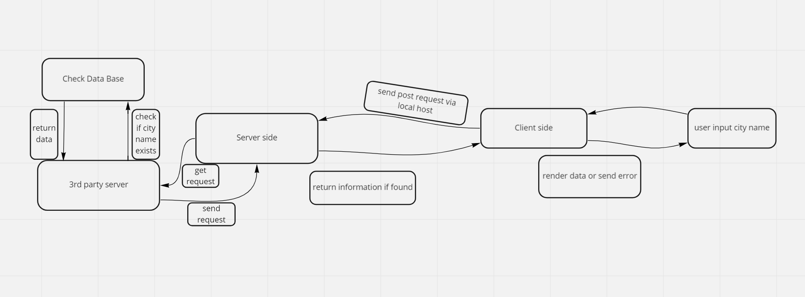

# city-explorer-api

**Author**: Mohammad Almomani
**Version**: 1.0.0 

class 7

class 8

class 9

same as yesterday 

## Overview
<!-- Provide a high level overview of what this application is and why you are building it, beyond the fact that it's an assignment for this class. (i.e. What's your problem domain?) -->

backend server for my website 'city explorer'

## Getting Started
<!-- What are the steps that a user must take in order to build this app on their own machine and get it running? -->

## Architecture
<!-- Provide a detailed description of the application design. What technologies (languages, libraries, etc) you're using, and any other relevant design information. -->

## Change Log
<!-- Use this area to document the iterative changes made to your application as each feature is successfully implemented. Use time stamps. Here's an example:

01-01-2001 4:59pm - Application now has a fully-functional express server, with a GET route for the location resource. -->

## Credit and Collaborations
<!-- Give credit (and a link) to other people or resources that helped you build this application. -->
my great college Omar Qattan

Name of feature: 2, axios and dotenv

Estimate of time needed to complete: 5 hours

Start time: 6:00Pm

Finish time: 10:00PM

Actual time needed to complete: 3 hours

## class 9

Name of feature: 2, require and module

Estimate of time needed to complete: 20 minutes

Start time: 12:00Pm

Finish time: 12:15PM

Actual time needed to complete: 10 minutes